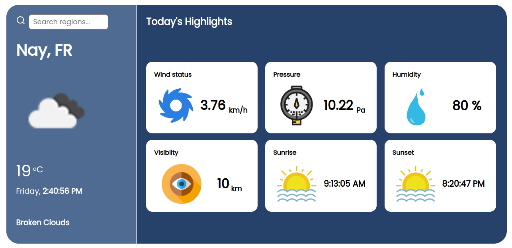
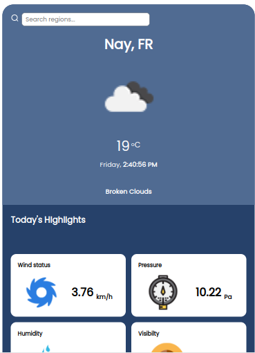
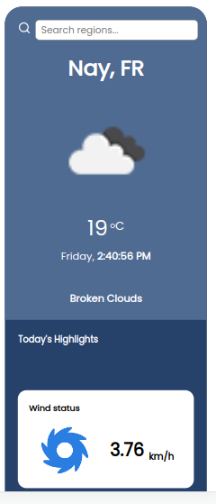

# Weather App
A react app that consumes the [openweathermap API](https://openweathermap.org/api) to show current weather status of a given region/area.

## Cloning the project

Clone the project to your local machine

```
git clone https://github.com/Jacobkyalo/react-weather-app
```

Run this command to install all project dependencies

```
npm install
```

---

# SetUp

Grab your api key from [openweathermap](https://openweathermap.org/api) and place it in a `.env.local` file at `root` of your project

```
REACT_APP_API_ID =****
```

To use this api key in your fetch function use

```
`...$appid=${process.env.REACT_APP_API_ID}...`
```

---

# Samples of project screenshots

| **Desktop view**                                      | **Tablet view**                                     | **Mobile view**                                     |
| ----------------------------------------------------- | --------------------------------------------------- | --------------------------------------------------- |
|  |  |  |

---

## Available Scripts

In the project directory, you can run:

### `npm start`

Runs the app in the development mode.\
Open [http://localhost:3000](http://localhost:3000) to view it in your browser.

The page will reload when you make changes.\
You may also see any lint errors in the console.

### `npm test`

Launches the test runner in the interactive watch mode.\
See the section about [running tests](https://facebook.github.io/create-react-app/docs/running-tests) for more information.

### `npm run build`

Builds the app for production to the `build` folder.\
It correctly bundles React in production mode and optimizes the build for the best performance.

The build is minified and the filenames include the hashes.\
Your app is ready to be deployed!

See the section about [deployment](https://facebook.github.io/create-react-app/docs/deployment) for more information.
